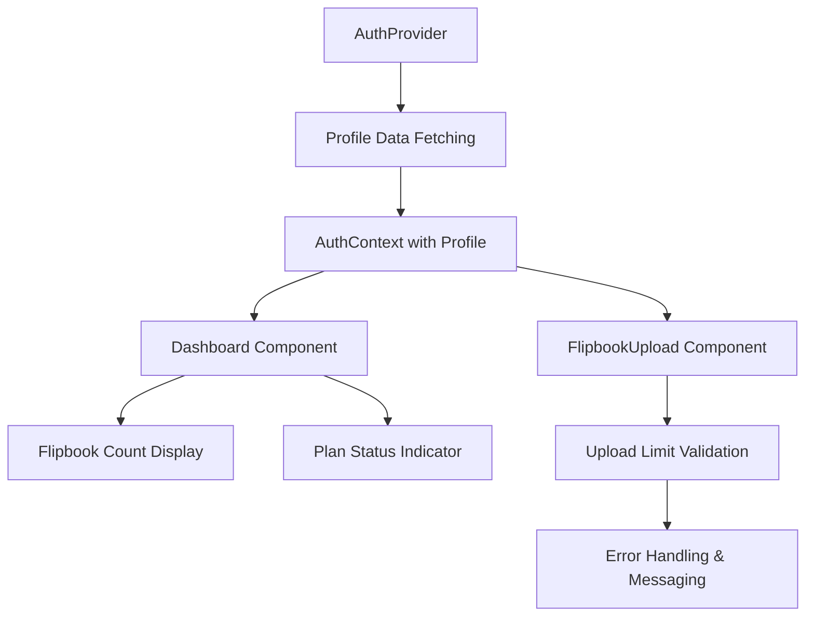

# Design Document

## Overview

The subscription plan limits feature will implement a tiered access system that controls flipbook creation based on user subscription plans. The system extends the existing authentication and database architecture to include plan information and enforces limits at the application level before upload processing.

## Architecture

### Database Schema Changes

The existing `profiles` table will be extended with a new `plan` column:

```sql
ALTER TABLE profiles 
ADD COLUMN plan TEXT DEFAULT 'free';
```

**Plan Types:**
- `free`: Limited to 3 flipbooks
- `premium`: Unlimited flipbooks (future extensibility for other plans)

### Authentication Context Enhancement

The current `AuthContext` will be extended to:
1. Fetch and store user profile data including plan information
2. Provide profile data to all components through the context
3. Handle profile creation/updates during authentication flow

### Component Architecture



## Components and Interfaces

### Enhanced AuthContext Interface

```typescript
interface AuthContextType {
  user: User | null;
  session: Session | null;
  profile: Profile | null;  // New: includes plan information
  signOut: () => Promise<void>;
}

type Profile = Tables<'profiles'> & {
  plan: 'free' | 'premium';  // Typed plan field
};
```

### FlipbookUpload Component Changes

The component will receive `flipbookCount` as a prop and validate against plan limits:

```typescript
interface FlipbookUploadProps {
  onUploadComplete?: () => void;
  flipbookCount: number;  // New: current user's flipbook count
}
```

**Validation Logic:**
1. Check user's plan from AuthContext
2. Compare current flipbook count against plan limits
3. Block upload and show upgrade message if limit exceeded
4. Allow upload if within limits

### Dashboard Component Changes

The Dashboard will:
1. Pass flipbook count to FlipbookUpload component
2. Display plan status and usage information
3. Show upgrade prompts when approaching limits

## Data Models

### Profile Model Extension

```typescript
interface Profile {
  id: string;
  email: string;
  full_name: string | null;
  avatar_url: string | null;
  plan: 'free' | 'premium';  // New field
  created_at: string | null;
  updated_at: string | null;
}
```

### Plan Configuration

```typescript
const PLAN_LIMITS = {
  free: {
    maxFlipbooks: 3,
    displayName: 'Free Plan'
  },
  premium: {
    maxFlipbooks: Infinity,
    displayName: 'Premium Plan'
  }
} as const;
```

## Error Handling

### Upload Blocking Flow

1. **Pre-upload Validation**: Check limits before file processing
2. **User Feedback**: Clear error messages with upgrade suggestions
3. **Graceful Degradation**: Maintain existing functionality for unlimited plans

### Error Messages

- **Limit Reached**: "You have reached the maximum of 3 flipbooks for the free plan. Please upgrade to create more."
- **Profile Loading Error**: Default to free plan restrictions for security
- **Database Error**: Fallback to client-side validation

### Fallback Behavior

- If profile fails to load: Apply free plan restrictions
- If plan field is null/undefined: Default to 'free'
- If flipbook count fails to load: Block uploads until resolved

## Testing Strategy

### Unit Testing Focus Areas

1. **AuthContext Profile Fetching**
   - Profile data loading on authentication
   - Error handling for profile fetch failures
   - Plan defaulting behavior

2. **Upload Validation Logic**
   - Limit enforcement for different plans
   - Edge cases (exactly at limit, over limit)
   - Error message generation

3. **Component Integration**
   - Props passing between Dashboard and FlipbookUpload
   - Context consumption in components
   - UI state updates based on plan status

### Integration Testing

1. **End-to-End Upload Flow**
   - Free user creating 3 flipbooks successfully
   - Free user blocked on 4th upload attempt
   - Premium user unlimited uploads

2. **Authentication Flow**
   - Profile creation on first login
   - Profile data availability after login
   - Plan information persistence across sessions

### Manual Testing Scenarios

1. **Free Plan User Journey**
   - Create account → Upload 3 flipbooks → Attempt 4th upload → See upgrade message
   
2. **Plan Upgrade Simulation**
   - Manually update plan in database → Verify immediate effect in UI

3. **Error Conditions**
   - Network failures during profile fetch
   - Database unavailability
   - Malformed profile data

## Implementation Considerations

### Performance

- Profile data fetched once per session and cached in context
- Flipbook count passed as prop to avoid redundant queries
- Client-side validation prevents unnecessary server requests

### Security

- Server-side validation should be added in future iterations
- Plan information stored in user-controlled profiles table
- RLS policies ensure users can only access their own data

### Scalability

- Plan configuration designed for easy extension
- Component architecture supports additional plan types
- Database schema allows for future plan feature additions

### User Experience

- Clear visual indicators of plan status and usage
- Proactive messaging before limits are reached
- Smooth upgrade path suggestions

## Migration Strategy

1. **Database Migration**: Add plan column with default 'free' value
2. **AuthContext Update**: Extend to fetch profile data
3. **Component Updates**: Add limit validation to FlipbookUpload
4. **UI Enhancements**: Add plan status displays to Dashboard
5. **Testing**: Verify all existing functionality remains intact